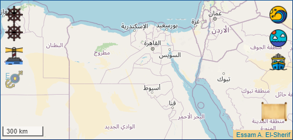

# Leaflet.themeControls

A set of **themeControls** that extend Leaflet native controls, and other additional controls, in order to customize the on-screen shape of the control as defined by the underlying css and image files provided.

Using **themeControls** within a web map will enhance the user interface with theme or cultural related icons.

<div>
<div style="text-align:right">
I am Essam
</div>
</div>

<div style="text-align:center">
	<a href="img/demo_egy.png" title="Ancient Egypt Theme"></a>
</div>

<div style="text-align:center">
	<a href="img/demo_alx.png" title="Alexandria City Theme"></a>
</div>

## Demo

1. [demo_1](https://career.essamonline.net) demonstrates using **themeControls** to provide a user interface relevant to *Ancient Egypt*.
2. [demo_2](https://career.essamonline.net) demonstrates using **themeControls** to provide a user interface relevant to the *Alexandria City of Egypt*.

## Control Class Hierarchy

| Class / Constructor                   | Factory function            | Description            | 
|---------------------------------------|-----------------------------|:----------------------:|
| `L.Control`                           |                             |                        |
| >>> `L.Control.Zoom`                  | `L.control.zoom`            | Leaflet native control |
| >>>>>> `L.ThemeZoomControl`           | `L.themeZoomControl`        | **themeControl**       |
| >>> `L.Control.Layers`                | `L.control.layers`          | Leaflet native control |
| >>>>>> `L.ThemeLayersControl`         | `L.themeLayersControl`      | **themeControl**       |
| >>> `L.Control.Attribution`           | `L.control.attribution`     | Leaflet native control |
| >>>>>> `L.ThemeAttributionControl`    | `L.themeAttributionControl` | **themeControl**       |
| >>> `L.Control.Screen`                | `L.control.screen`          | Additional control     |
| >>>>>> `L.ThemeScreenControl`         | `L.themeScreenControl`      | **themeControl**       |
| >>> `L.Control.Bookmark`              | `L.control.bookmark`        | Additional control     |
| >>>>>> `L.ThemeBookmarkControl`       | `L.themeBookmarkControl`    | **themeControl**       |
| >>> `L.Control.MessageBox`            | `L.control.messageBox`      | Additional control     |
| >>>>>> `L.ThemeMessageBox`            | `L.themeMessageBox`         | **themeControl**       |
| >>> `L.Control.Theme`                 | `L.control.theme`           | **themeControl**       |

## Usage

In order to use this plugin, include the essential [JS](src/theme-leaflet-controls.js) and [CSS](src/css/theme-egy-leaflet-controls.css) files in your HTML page as follows:

```
<html>
    <head>
        <link rel="stylesheet" type="text/css" href="https://unpkg.com/leaflet@1.7.1/dist/leaflet.css" />
        <link rel="stylesheet" type="text/css" href="src/css/theme-egy-leaflet-controls.css" />

        <script type="text/javascript" src="https://unpkg.com/leaflet@1.7.1/dist/leaflet.js"></script>
        <script type="text/javascript" src="src/theme-leaflet-controls.js"></script>
    </head>
```

Each theme will be associated with a separate CSS file and linked image files. In order to build up your theme:

1. Prepare the set of image (png) files that will be linked to each of the **themeControls**.
2. Assign a name to your theme, preferably 3 or 4 letters, example **'xyz'**.
3. Rename the given CSS file to reflect your theme **theme-xyz-leaflet-controls.css**.
4. Within the **theme-xyz-leaflet-controls.css** file, replace any existence of my Ancient Egypt theme **'egy'** with yours **'xyz'**.
5. Alter the links to the image files in order to link to your files.
6. Include your CSS file in the HTML file as shown above.
7. Use the new CSS class names to create the **themeControls** within the \<script> section of your HTML file.

## Supported Leaflet Versions

## License

This plugin is licensed under the GPL license, see the LICENSE file.
